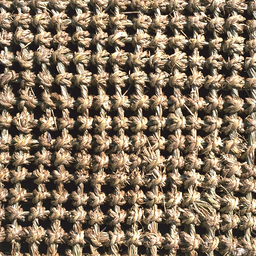
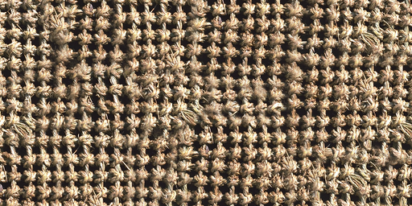
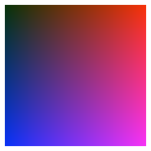
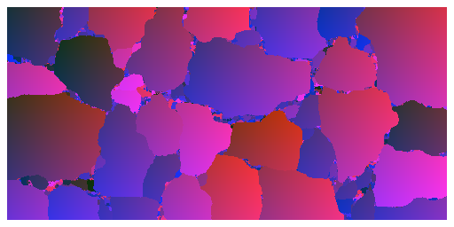
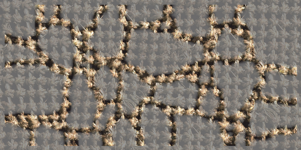
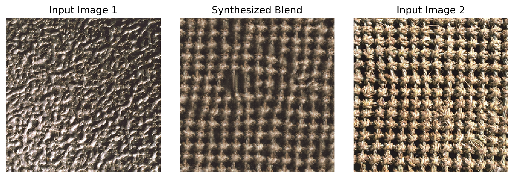
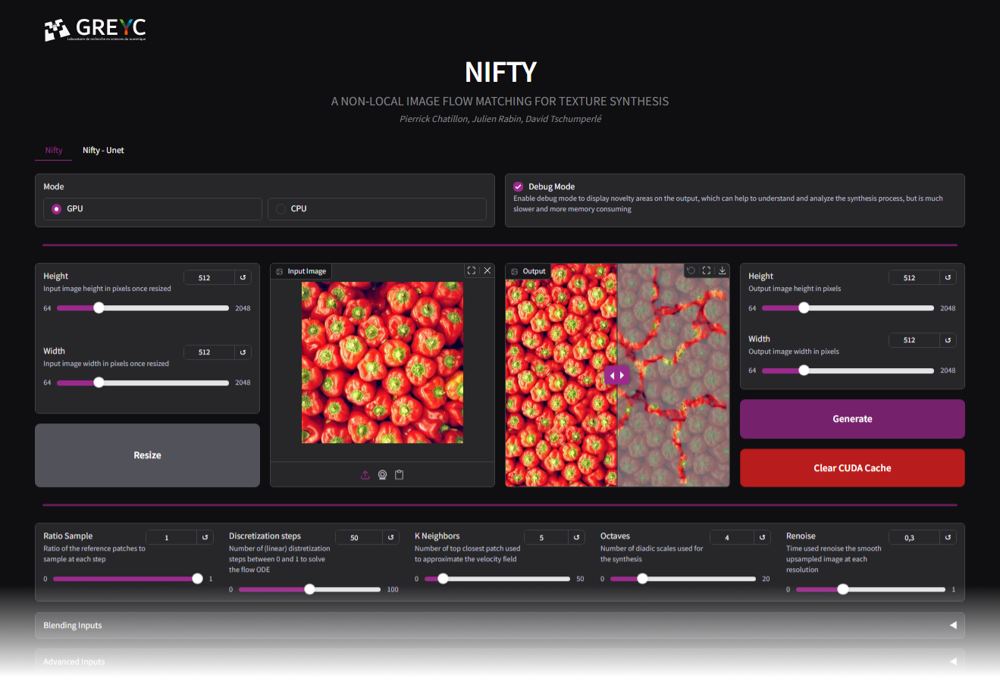

# Official pytorch implementation of the paper: "NIFTY: A non-local image flow matching for texture synthesis"
[Pierrick Chatillon](https://scholar.google.com/citations?user=8MgK55oAAAAJ&hl=en) | [Julien Rabin](https://sites.google.com/site/rabinjulien/) | [David Tschumperlé](https://tschumperle.users.greyc.fr/)


[Arxiv](http://arxiv.org/abs/2509.22318) [Paper]() [HAL](https://hal.science/hal-05287967)


### Visualization: Nearest Neighbor for Each Pixel of a Synthesized Image

<table>
  <tr>
    <td><strong>Reference</strong></td>
    <td><strong>Synthesized</strong></td>
  </tr>
  <tr>
    <td></td>
    <td></td>
  </tr>
  <tr>
    <td><strong>Ground Positions</strong></td>
    <td><strong>Position of Nearest Neighbor</strong></td>
  </tr>
  <tr>
    <td></td>
    <td></td>
  </tr>
  <tr>
    <td></td>
    <td align="center"><strong>Highlight of Novel Regions</strong></td>
  </tr>
  <tr>
    <td></td>
    <td></td>
  </tr>
</table>


### Interpolation example:



## Installation

These commands will create a conda environment called simulditex with the required dependencies, then place you in it :
```
conda env create -f requirements.yml
conda activate nifty
```


## Inference

All experiments with hyperparameters are replicable in the notebook experiments.ipynb.
The notebook saves the results in ./results/

## Reproducibility
For reproducibility, all expermients are seeded in experiments.ipynb.\
Additionally, seeded inference are provided in reproducible_inference.ipynb, allowing to reproduce figures and tables in the article.\
The results of these seeded runs are provided in .zip files under ./comparison/synthesis4metrics.zip , you can either run the notebook or unzip the files.\
Some inference require training a network. The weights are provided under ./comparison/model4metrics.zip. Either way, the training phase is seeded and can be reproduced.\
After recomputing or unzipping, you can compute the metrics from Table 1 by running:
```
python Nifty/metrics.py
```
## Demo

*Demo implementation by [Mahé DUVAL](https://github.com/MarageDev)*

<br>

The repository contains a general demo file using the open-source Python package Gradio to render the user interface. The main demo file is located under : `Demos/demo.py`.

The demo includes experiments from the [Jupyter Notebook : experiments.ipynb](reproduce_figures.ipynb).

### How to run
To launch the demo, start the python script in the virtual environment :  
```shell
python ./Demos/demo.py
```
or use gradio hot reload mode (if you plan to edit the code) with 
```shell
gradio ./Demos/demo.py
```

After running one of these two commands, the models will be loaded and a local URL for the demo should appear. Open this URL to access the demos.
### Nifty sub-demo
The `Debug Mode` lets you visualize the copied regions, highlighted in gray, as well as the newly generated ones.

The input `Height` and `Width` parameters (on the left) let you resize the image if needed, in order to reduce computation time.

The output `Height` and `Width` parameters (on the right) let you define the size of the texture synthesis to be generated.

Clicking `Generate` starts the texture synthesis process with the specified parameters.

Clicking `Clear CUDA Cache` clears the GPU cache used by the program; use this when an `Out Of Memory` error occurs.

If changing the parameters causes a computation error, and you cannot fix the issue, load an example (this resets the parameters to their default values in the case of example 1).

Parameters:
- `rs`: ratio of reference patches to sample at each step.
- `T`: number of discretization steps used to solve the flow matching ODE.
- `k`: number of nearest patches used to approximate the field velocity (flow matching method).
- `octaves`: number of dyadic scales used for the synthesis.
- `renoise`: factor used to adjust the intensity of the noise added at each step when the resolution increases.

- `Blend`: mixes the synthesized image with the input image, which can help preserve part of the input image structure.
- `Blend Alpha`: weighting factor for the mix between the synthesized texture and the input image.
- `Blend Map`: if checked, textures will be blended linearly (from right to left, with a mix of both in the middle).

- `Patch Size`: size of the patches used by the algorithm (the larger the patches, the larger the copied areas).
- `Stride`: number of jumps used to compute flow matching (increasing the stride reduces computation time).
- `Warmup` (if `Memory` is enabled): number of initial steps during which the flow is not applied, which can help stabilize the synthesis at the beginning.
- `Memory`: use the memory-efficient version of Nifty, which does not store all intermediate synthesized images during flow integration, but only the current image.
- `Seed`: random seed (the same seed for a given random process returns the same value; thus, for texture synthesis, the same seed gives the same result if the parameters are identical).
- `Noise`: adds noise during synthesis, which can help escape local minima and produce more diverse results.
- `Spot Size`: size of the spots used for synthesis, relative to the patch size.

A list of examples from the paper is available at the bottom of the demo.

### Nifty - Unet sub-demo
This sub-demo lets you visualize the differences between a model loaded in `Load Model` and Nifty. It is also possible to train one using the right side of the demo, `Train Model`.

Most of the parameters from the Nifty section are also present in this section.

## Acknowledgments
This  work  was  partly  funded  by  the  Normandy  Region  through  the IArtist excellence label project.

## Citation
If you use this code for your research, please cite our paper, ICASSP 2026 citation will be updated after publication:

```
@inproceedings{NIFTY,
  TITLE = {{NIFTY: a Non-Local Image Flow Matching for Texture Synthesis}},
  AUTHOR = {Chatillon, Pierrick and Rabin, Julien and Tschumperl{\'e}, David},
  URL = {https://hal.science/hal-05287967},
  BOOKTITLE = {{ICASSP}},
  ADDRESS = {Barcelona, Spain},
  YEAR = {2026},
  MONTH = May,
  DOI = {10.48550/arXiv.2509.22318},
  KEYWORDS = {Machine Learning (cs.LG) ; Computer Vision and Pattern Recognition (cs.CV) ; Flow Matching ; Texture synthesis ; Image synthesis ; Generative model},
  PDF = {https://hal.science/hal-05287967v1/file/2509.22318v1.pdf},
  HAL_ID = {hal-05287967},
  HAL_VERSION = {v1},
}

```

## License
This work is under the MIT license.

## Disclaimer
The code is provided "as is" with ABSOLUTELY NO WARRANTY expressed or implied.