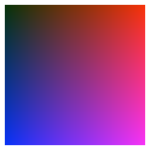

# NIFTY: A NON-LOCAL IMAGE FLOW MATCHING FOR TEXTURE SYNTHESIS
[Pierrick Chatillon](https://scholar.google.com/citations?user=8MgK55oAAAAJ&hl=en) | [Julien Rabin](https://sites.google.com/site/rabinjulien/) | [David Tschumperlé](https://tschumperle.users.greyc.fr/)


[Arxiv]() [Paper]() [HAL]()

## Official pytorch implementation of the paper: "NIFTY: A non-local image flow matching for texture synthesis"

### Visualization: Nearest Neighbor for Each Pixel of a Synthesized Image
| Reference | Synthesized |
|-----------|-------------|
|  |  |

| Ground Truth Warp | Predicted Warp |
|-------------------|----------------|
|  |  |

### Highlight of Novel Regions

<p align="right">
  
</p>


### Interpolation example:


## Installation

These commands will create a conda environment called simulditex with the required dependencies, then place you in it :
```
conda env create -f requirements.yml
conda activate nifty
```


## Inference

All experiments with hyperparameters are replicable in the notebook Experiments.ipynb.
The notebook saves the results in ./results/

For reproductibility, seeded inference are provided in reproductible_inference.ipynb, allowing to reproduce figures and tables in the article.
The results of these seeded runs are prvovided in .zip files under ./comparison/ , you can either run the notebook or unzip the files.

## Acknowledgments
This  work  was  partly  funded  by  the  Normandy  Region  through  theIArtist excellence label project.

## Citation
If you use this code for your research, please cite our paper:

```

```

## License
This work is under the MIT license.

## Disclaimer
The code is provided "as is" with ABSOLUTELY NO WARRANTY expressed or implied.