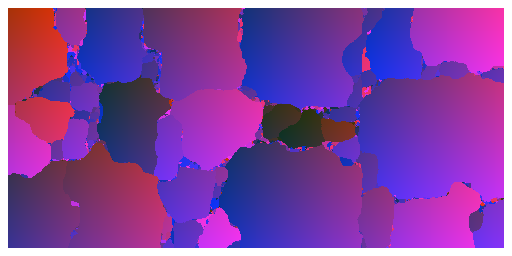
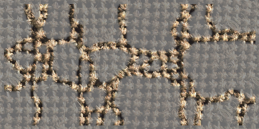

# Official pytorch implementation of the paper: "NIFTY: A non-local image flow matching for texture synthesis"
[Pierrick Chatillon](https://scholar.google.com/citations?user=8MgK55oAAAAJ&hl=en) | [Julien Rabin](https://sites.google.com/site/rabinjulien/) | [David Tschumperlé](https://tschumperle.users.greyc.fr/)


[Arxiv]() [Paper]() [HAL]()


### Visualization: Nearest Neighbor for Each Pixel of a Synthesized Image

<table>
  <tr>
    <td><strong>Reference</strong></td>
    <td><strong>Synthesized</strong></td>
  </tr>
  <tr>
    <td></td>
    <td></td>
  </tr>
  <tr>
    <td><strong>Ground Positions</strong></td>
    <td><strong>Position of Nearest Neighbor</strong></td>
  </tr>
  <tr>
    <td></td>
    <td></td>
  </tr>
  <tr>
    <td></td>
    <td align="center"><strong>Highlight of Novel Regions</strong></td>
  </tr>
  <tr>
    <td></td>
    <td></td>
  </tr>
</table>


### Interpolation example:


## Installation

These commands will create a conda environment called simulditex with the required dependencies, then place you in it :
```
conda env create -f requirements.yml
conda activate nifty
```


## Inference

All experiments with hyperparameters are replicable in the notebook experiments.ipynb.
The notebook saves the results in ./results/

## Reproducibility
For reproducibility, all expermients are seeded in experiments.ipynb.\
Additionally, seeded inference are provided in reproducible_inference.ipynb, allowing to reproduce figures and tables in the article.\
The results of these seeded runs are provided in .zip files under ./comparison/ , you can either run the notebook or unzip the files.\
After recomputing or unzipping, you can compute the metrics from Table 1 by running:
'''
python Nifty/metrics.py
'''

## Acknowledgments
This  work  was  partly  funded  by  the  Normandy  Region  through  theIArtist excellence label project.

## Citation
If you use this code for your research, please cite our paper:

```

```

## License
This work is under the MIT license.

## Disclaimer
The code is provided "as is" with ABSOLUTELY NO WARRANTY expressed or implied.